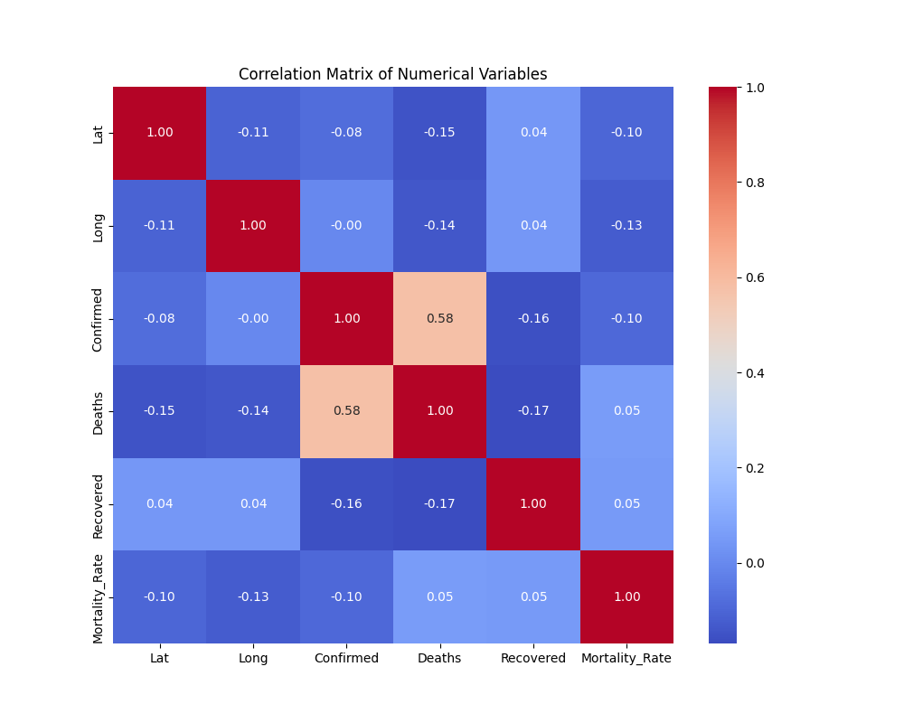
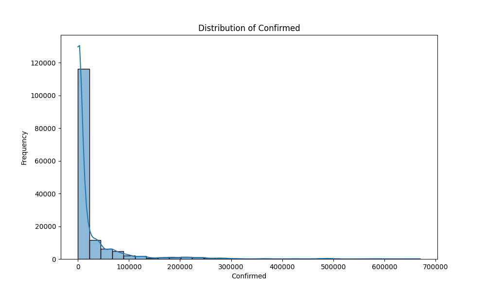
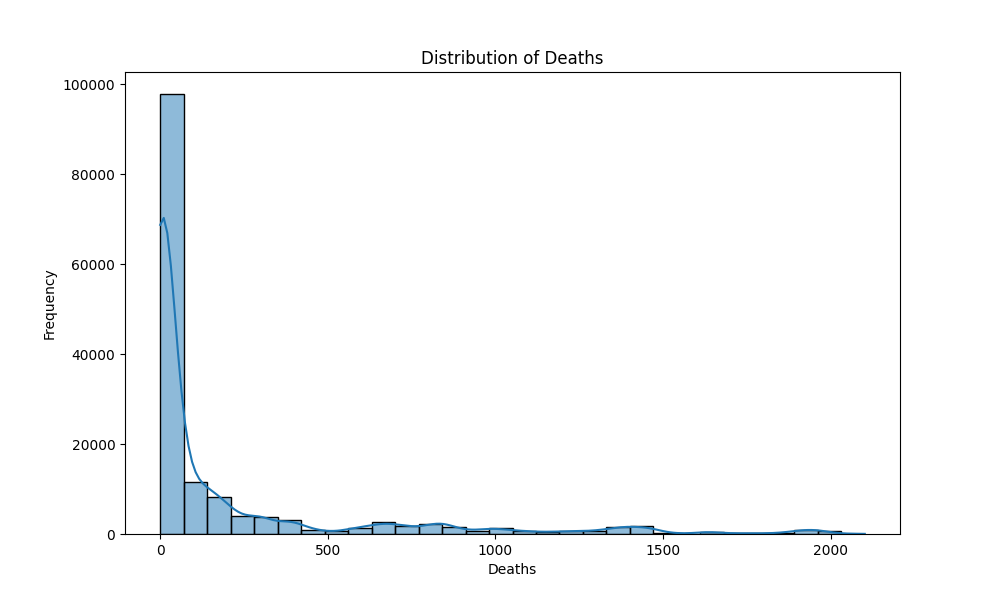
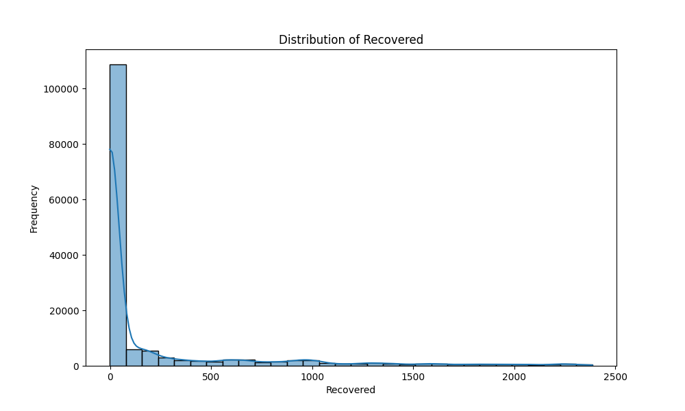
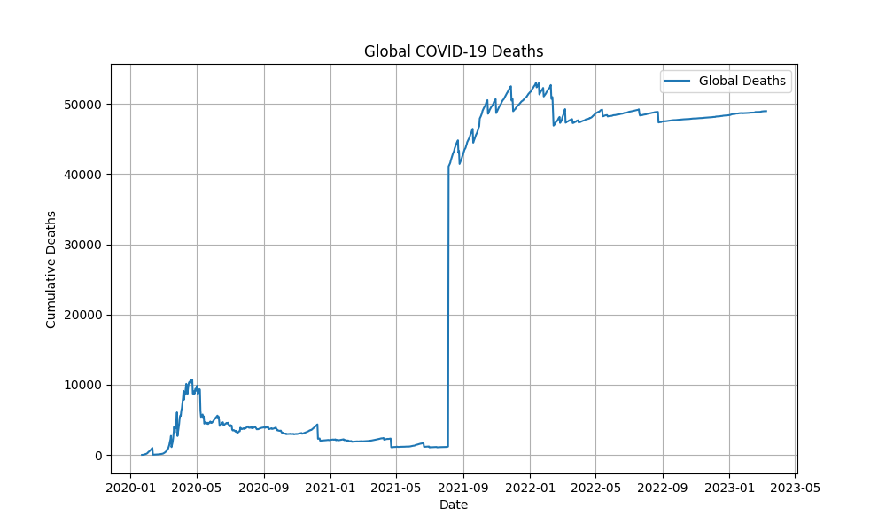
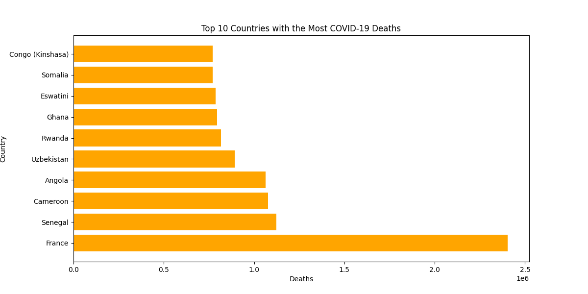
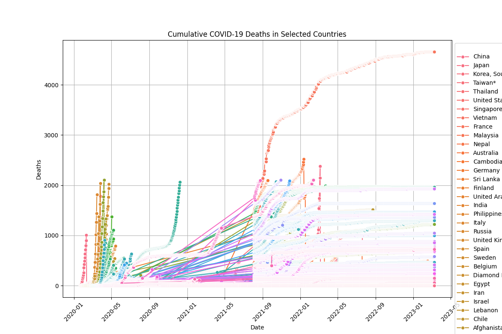
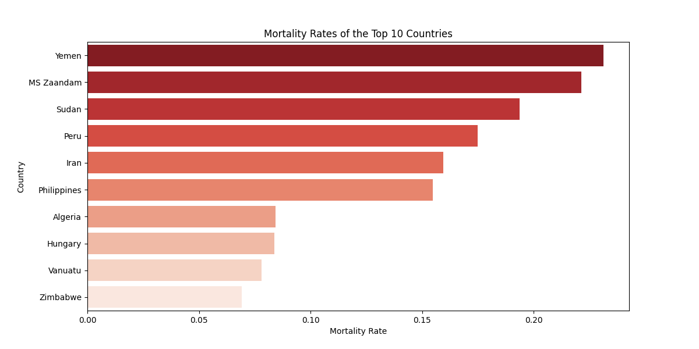
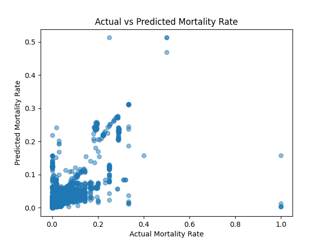

# Analysis of COVID-19 mortality rate

## Data retrival and preparation

**The loading and processing of the data was handled in the function `loadCovidData()`.**\
The function returns a pd.DataFrame.

\
The data used in this project was retrieved from the Johns Hopkins University repository using URLs, which were used to load the CSV files into Pandas DataFrames.

\
**Reshaping the Data:**
- The data is transformed from a wide format (dates as column headers) to a long format, where each row represents a single observation with a specific date, region, and count of cases, deaths, or recoveries. This makes the data easier to merge and analyze.

\
**Date Conversion into datetime**:
- The date column, originally in string format, is converted into a datetime format using `pd.to_datetime()` to ensure the data is properly understood and can be effectively manipulated for analysis.

\
**Merging the Data:**
- The three datasets (confirmed cases, deaths, and recoveries) are merged into a single, unified DataFrame using common columns such as province/state, country/region, latitude, longitude, and date.

\
**Dataset after merging the three datasets into one (prints are in the main method):**
```console
#   print(df.head())
  Province/State Country/Region       Lat  ...  Confirmed Deaths  Recovered
0            NaN    Afghanistan  33.93911  ...          0      0          0
1            NaN        Albania  41.15330  ...          0      0          0
2            NaN        Algeria  28.03390  ...          0      0          0
3            NaN        Andorra  42.50630  ...          0      0          0
4            NaN         Angola -11.20270  ...          0      0          0

[5 rows x 8 columns]

#   print("\nShape of the data:", df.shape)
Shape of the data: (306324, 8)

#   print("\nColumn names:", df.columns)
Column names: Index(['Province/State', 'Country/Region', 'Lat', 'Long', 'Date', 'Confirmed',
       'Deaths', 'Recovered'],
      dtype='object')
#   print(f"\nNumber of records: {df.shape[0]}")
Number of records: 306324
```

## Data cleaning and extraction
**The cleaning and extraction of the data was handled in the function `cleanData(df)`.**\
The function expects a pd.DataFrame as parameter and returns a cleaned pd.DataFrame.

\
**Removing Duplicates:**
- Any duplicate rows are dropped to avoid redundant data entries.

\
**Handling Missing Values:**
- The columns are categorized into numerical and categorical for targeted cleaning.
- Missing values in numerical columns are replaced with 0, while categorical columns are filled with the placeholder "unknown."
- Rows with excessive missing data (more than 30%) are removed to maintain data integrity.

\
**Outlier Detection and Removal:**
- The Interquartile Range (IQR) method is applied to identify and remove rows with outliers in numerical columns.

\
**Logical Consistency Checks:**
- Ensures that the number of deaths does not exceed the number of confirmed cases as this could make the model predictions less accurate.

\
**Standardizing Country Names:**
- Country names are standardized ("US"/ "U.S" is replaced with "United States" and "UK is replaced with "United Kingdom) to ensure more accurate predictions.

\
**Variable transformation:**
- Extracts new features from the date column so we can use the date data to train our model
  - Day of the Week: A numerical representation (0 = Monday, 6 = Sunday).
  - Month: The calendar month of the observation.
  - Day of the Year: A number indicating the day's position in the year.
  
- Calculates the mortality rate as the percentage of deaths out of confirmed cases, as this will be the predicted value in our model.

\
**Final Cleaning:**
- Removes any rows with infinite or NaN values in the newly calculated Mortality_Rate column.
- Drops remaining rows with missing values to ensure a clean dataset.

\
**Missing values in the dataset before cleaning:**
```console
#   print("\nMissing values in the columns:", df.isnull().sum())
Missing values in the columns: 
Province/State    222885
Country/Region         0
Lat                 1143
Long                1143
Date                   0
Confirmed              0
Deaths                 0
Recovered              0
dtype: int64
```

\
**Dataset after cleaning:**
```console
#   print(df_cleaned.head())
   Province/State Country/Region      Lat  ...  Month Day_of_Year  Mortality_Rate
43          Anhui          China  31.8257  ...      1          22             0.0
44        Beijing          China  40.1824  ...      1          22             0.0
45      Chongqing          China  30.0572  ...      1          22             0.0
46         Fujian          China  26.0789  ...      1          22             0.0
48      Guangdong          China  23.3417  ...      1          22             0.0

[5 rows x 12 columns]

#   print("\nColumn names after transforming:", df_cleaned.columns)
Column names after transforming: Index(['Province/State', 'Country/Region', 'Lat', 'Long', 'Date', 'Confirmed',
       'Deaths', 'Recovered', 'Day_of_Week', 'Month', 'Day_of_Year',
       'Mortality_Rate'],
      dtype='object')

#   print(f"\nNumber of records after cleaning: {df_cleaned.shape[0]}")
Number of records after cleaning: 150432

#   print("\nMissing values in the columns after cleaning:", df_cleaned.isnull().sum())
Missing values in the columns after cleaning: 
Province/State    0
Country/Region    0
Lat               0
Long              0
Date              0
Confirmed         0
Deaths            0
Recovered         0
Day_of_Week       0
Month             0
Day_of_Year       0
Mortality_Rate    0
dtype: int64
```
## Data exploration and visualization
**The exploration and visualization of the data was handled in the functions `dataExploration()`, `cumulativeDeaths()`, `topCountries()`, `cumulativeByCountry()` and `mortalityRateComparison()`.**\
The functions each expect a cleaned pd.DataFrame as parameter and print one or more plots.

`dataExploration(df)`
- Prints descriptive statistics (e.g., mean, min, max) for numerical columns.
```console
Descriptive Statistics:
                 Lat           Long  ...    Day_of_Year  Mortality_Rate
count  150432.000000  150432.000000  ...  150432.000000   150432.000000
mean       16.924450      38.960620  ...     180.412412        1.577900
min       -42.882100    -159.777700  ...       1.000000        0.000000
25%         3.933900     -11.779889  ...      89.000000        0.110469
50%        17.570692      29.918900  ...     178.000000        0.692841
75%        35.126400     112.292200  ...     271.000000        1.652893
max        71.706900     178.065000  ...     366.000000      100.000000
std        22.940687      75.941242  ...     105.315916        3.442672

[8 rows x 10 columns]
```

- Calculates the correlation matrix and visualizes a correlation heatmap for numerical variables to identify relationships. 
- We can see that Deaths and Confirmed strongly depend on each other

Correlation Matrix (Console)
```console
Correlation Matrix (Numerical Columns Only):
                     Lat      Long  ...  Recovered  Mortality_Rate
Lat             1.000000 -0.105815  ...   0.040627       -0.100704
Long           -0.105815  1.000000  ...   0.041068       -0.127642
Confirmed      -0.080478 -0.002497  ...  -0.159234       -0.095367
Deaths         -0.150065 -0.141271  ...  -0.169566        0.054848
Recovered       0.040627  0.041068  ...   1.000000        0.052829
Mortality_Rate -0.100704 -0.127642  ...   0.052829        1.000000

[6 rows x 6 columns]
```
Correlation Matrix of Numerical Variables:


- Plots histograms for key variables (Deaths, Confirmed, Recovered) to examine their distributions.

Distribution of Confirmed:


Distribution of Deaths:


Distribution of Recovered:


\
`cumulativeDeaths(df)`\
Visualizes the global cumulative COVID-19 deaths over time.
- Groups data by Date and sums up Deaths for each day globally.
- Creates a line chart showing the growth of deaths over time.

Global Deaths during the provided timeframe:


\
`topCountries(df)`\
Identifies and visualizes the top 10 countries with the highest total COVID-19 deaths.
- Groups data by Country/Region and sums up the Deaths for each country.
- Sorts countries by total deaths in descending order.
- Creates a horizontal bar chart for the top 10 countries

Countries with the Top 10 highest Death Rates:


\
`cumulativeByCountry(df, countries)`\
Visualizes cumulative deaths over time for specific countries (Not ideal but included for visualization purposes).
- The countries-list is assigned straight from the 'Country/Region' column of the dataset when calling the function in the main method: 

- Filters data for the given list of countries.
- Groups data by Date and Country/Region, summing up Deaths.
- Creates a line plot for cumulative deaths, with separate lines for each selected country (Probably too many countries to visualize, hence it breaks after May 2021).

Cumulative Deaths:


\
`mortalityRateComparison(df)`
- Compares the average mortality rates (deaths/confirmed cases) of the top 10 countries.
- Calculates a new column, Mortality_Rate, as Deaths / Confirmed (Added this function before adding the Mortality Rate column in cleanData(), hence it creates a new column for visualization purposes)
- Groups data by Country/Region and computes the average mortality rate for each country.
- Sorts countries by their mortality rates in descending order.
- Creates a horizontal bar chart to visualize the top 10 countries with the highest mortality rates.

Countries with the Top 10 highest Mortality Rates:



## Model building and evaluation

**The model building and evaluation process is handled in the function `modelBuilder(df)`.**\
The function expects a cleaned pd.DataFrame as a parameter and performs the following steps:

**Features and Target Variable**\
The features (X) are selected by dropping columns that are not relevant to the model prediction, such as Confirmed, Deaths, Recovered, Mortality_Rate, and Date. The target variable (y) is set to the Mortality_Rate column, which is what the model will predict.

- The columns `Confirmed`, `Deaths`, and `Recovered` are excluded because they are directly tied to the calculation of Mortality_Rate. Including these would result in data leakage, where the model might use information it wouldn't realistically have when making predictions in the real world.
- The `Date` column is dropped because features like day, month, or day of the week are already extracted separately as part of the preprocessing pipeline. Including raw date values would not add meaningful information for the model.
- The target variable for the model is the `Mortality_Rate` because our goal is to predict the mortality rate based on other features. Mortality rate is the percentage of deaths among confirmed cases.

\
**Data Splitting**\
The dataset is split into training and testing sets using an 80/20 ratio. This is done using the `train_test_split()` function from `sklearn.model_selection`. The training set is used to fit the model, while the testing set evaluates the model's performance on unseen data.
- The 80/20 split ensures that the model is trained on a sufficiently large portion of the data (80%) to capture patterns and relationships, while reserving 20% for evaluation. This split ratio is a standard practice in machine learning which is why I chose this ratio.
- The random_state parameter is set to ensure reliability, so the split remains consistent across different runs. I chose the number 42, because I saw it in multiple tutorials and example codes.

Train Set:
```console
print("\nTrain Set Overview:")
Train Set Overview:
       Province/State  Country/Region      Lat  ...  Day_of_Week  Month  Day_of_Year
32100         unknown      San Marino  43.9424  ...            2      5          141
179991        unknown           Malta  35.9375  ...            1     11          327
218868   Sint Maarten     Netherlands  18.0425  ...            6      4          107
92168         Bermuda  United Kingdom  32.3078  ...            2     12          365
208301       Shandong           China  36.3427  ...            2      3           68

[5 rows x 7 columns]

print("\nTrain Set Description:")
Train Set Description:
                 Lat           Long  ...          Month    Day_of_Year
count  120345.000000  120345.000000  ...  120345.000000  120345.000000
mean       16.888270      38.810381  ...       6.430238     180.351365
std        22.953208      76.018134  ...       3.445614     105.299834
min       -42.882100    -159.777700  ...       1.000000       1.000000
25%         3.933900     -11.779889  ...       3.000000      89.000000
50%        17.570692      29.918900  ...       6.000000     178.000000
75%        35.126400     112.292200  ...       9.000000     271.000000
max        71.706900     178.065000  ...      12.000000     366.000000
[8 rows x 5 columns]
```

Test Set:
```console
print("\nTest Set Overview:")
Test Set Overview:
       Province/State  Country/Region  ...  Month  Day_of_Year
297188        Bermuda  United Kingdom  ...      2           34
155601        unknown        Maldives  ...      8          236
213928        Shaanxi           China  ...      3           89
198650        Ningxia           China  ...      2           32
182877        unknown         Finland  ...     12          338

print("\nTest Set Description:")
Test Set Description:
                Lat          Long   Day_of_Week         Month   Day_of_Year
count  30087.000000  30087.000000  30087.000000  30087.000000  30087.000000
mean      17.069165     39.561561      2.983481      6.439891    180.656596
std       22.890340     75.631173      2.005351      3.447419    105.381611
min      -42.882100   -159.777700      0.000000      1.000000      1.000000
25%        3.933900    -10.940800      1.000000      3.000000     88.000000
50%       17.607789     30.217600      3.000000      6.000000    179.000000
75%       35.126400    112.292200      5.000000      9.000000    271.000000
max       71.706900    178.065000      6.000000     12.000000    366.000000
[5 rows x 7 columns]
```
\
**Data Preprocessing**\
The dataset is preprocessed by separating categorical and numerical columns, allowing for targeted transformations specific to each data type:  
- Numerical columns are standardized using `StandardScaler`. This ensures all numerical features have a mean of 0 and a standard deviation of 1, aligning their magnitudes. Standardization helps models, by improving numerical stability and reducing bias from features with larger ranges.
- Categorical columns, `Country/Region` and `Province/State`, are one-hot encoded using `OneHotEncoder`. This transformation represents each category as a separate binary column, ensuring the model treats each category as independent.
  - StandardScaler ensures that numerical features are on the same scale, preventing features with large values (e.g., longitude) from dominating features with smaller ranges (e.g., incident rates). This is important because models like Gradient Boosting, though robust to unscaled data, can benefit from standardized features. This step also ensures that the model doesn't give undue weight to features simply because they have larger ranges.
  - Categorical features such as Country/Region and Province/State were one-hot encoded. One-hot encoding creates binary columns for each category, allowing the model to learn the influence of different categories without assuming any ordinal relationship between them. For example, countries like "United States" and "China" are independent categories that cannot be compared directly in terms of magnitude, which is why one-hot encoding is appropriate here.
- These preprocessing steps are implemented via a ColumnTransformer, ensuring both transformations are applied consistently and efficiently before model training.

\
**Model Definition**\
The predictive model is built using `GradientBoostingRegressor`, a machine learning algorithm suited for handling complex, non-linear relationships in data.  
- learning_rate=0.05: The learning rate was set to a relatively low value (0.05) to prevent overfitting and ensure gradual learning. A smaller learning rate leads to slower, more precise updates during training.


- max_depth=7: The max depth of 7 was chosen to control the complexity of the model and avoid overfitting. Deeper trees may fit the data too closely, but limiting the depth helps the model generalize better.


- n_estimators=300: I used 300 estimators (trees) to allow for sufficient model complexity while controlling for overfitting. This provides a good balance between capturing the relationships in the data and not overfitting.


- The preprocessing and model steps are combined into a single pipeline to ensure that data preprocessing and model training occur sequentially.


- The decision to use `GradientBoostingRegressor` was made after comparing the predictions using different models like `XGBoost` and `LinearRegression` and concluding that GradientBoostingRegressor produces the most accurate predictions.


\
**Model Training**
- The model is trained on the training dataset (X_train, y_train) using the `fit()` method of the pipeline.

\
**Predictions and Evaluation**
- After training, the model makes predictions on the test set (X_test).
- The model's performance is evaluated using three metrics:
  - Mean Absolute Error (MAE): Measures the average magnitude of errors in predictions.
  - Mean Squared Error (MSE): Measures the average squared difference between the predicted and actual values.
  - R-squared (R²): Indicates how well the model explains the variance in the target variable.

```console
print(f"\nMAE: {mae}, MSE: {mse}, R²: {r2}")
MAE: 0.008186468403731188, MSE: 0.0004403838171951204, R²: 0.6331801722529182
```
\
**Model Visualization**
- A scatter plot is generated to visualize the relationship between the actual mortality rates (y_test) and the predicted values (y_pred).
- This visualization helps evaluate how well the model's predictions match the actual outcomes.

Actual vs Predicted Mortality Rate:



## Main-Method
All the functions are being called in the main-method and the output of the functions is stored in local variables. Descriptive prints about the dataframes are printed after calling each functions.
## Author
Kim Geestmann 